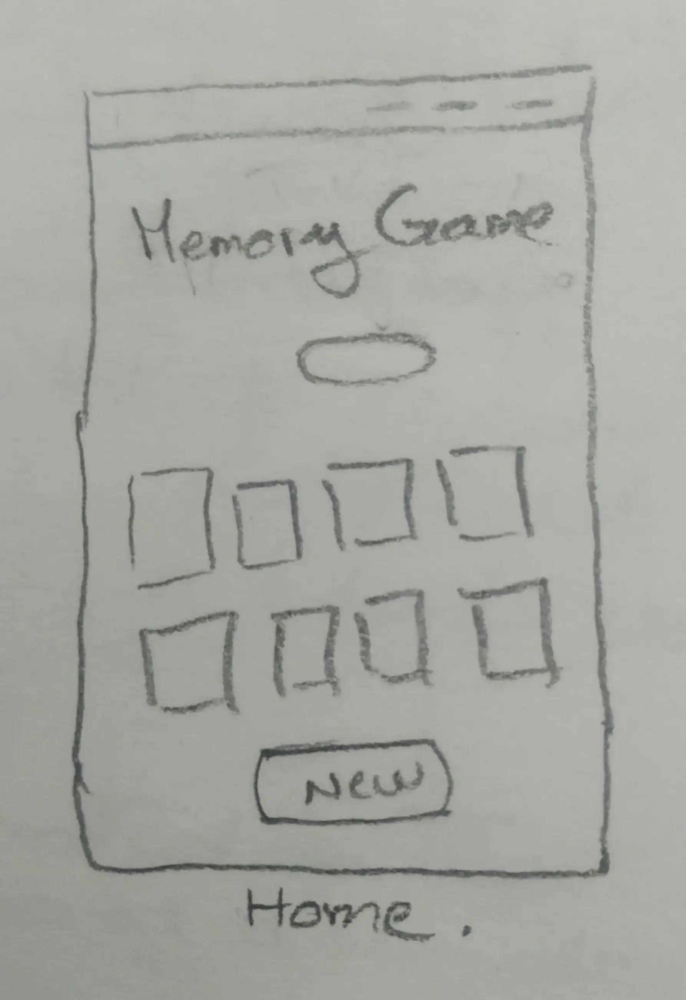
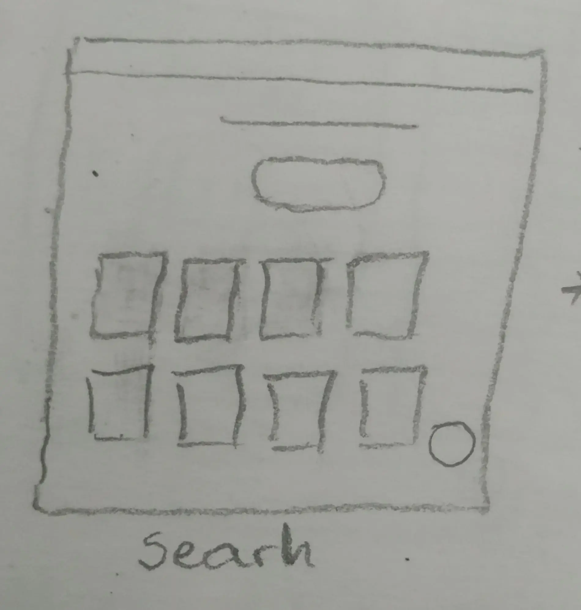
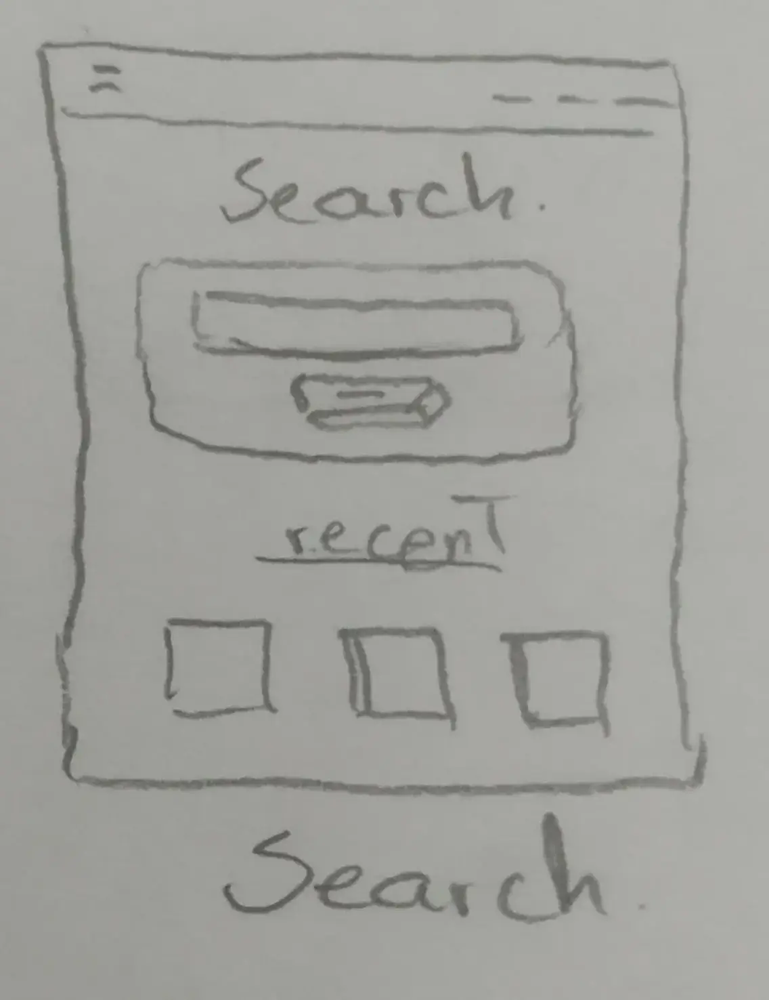

<!-- PokeApp banner -->

  

  
  

 

Cambiar a:&nbsp; &nbsp; 

---
<!-- title and description -->
# FullPokeApp
Aplicación web de Pokémon desarrollada con React.js, Sass y Nextui. 
 

## Características clave:

  

   &nbsp; &nbsp;
    Juego de memoria:
  

 

Desafía tu memoria y tus habilidades cognitivas con un juego de memoria protagonizado por Pokémones.

 

 
 

### Detalles:

  

  El juego comienza con todas las cartas boca abajo y el jugador voltea dos cartas por cada movimiento. Si las dos cartas tienen la misma imagen, se quedan boca arriba; de lo contrario, vuelven a estar boca abajo. 

### Componentes
  - 12 cartas pokémon.
  - Botón de reset, para jugar de nuevo con las mismas cartas en diferente orden.
  - Botón de new Game, para cambiar de cartas.
  - Contador de movimientos.
  - Pop-up con datos de la partida ganada y botones para jugar nueva partida, resetear la partida o cerrar el pop-up.

  

---

  

   &nbsp; &nbsp;
    Buscador de pokemones:
  

 

Busca tus Pokémons favoritos y selecciona para ver sus detalles.

 
 

### Detalles:

  

  Busca por coincidencia con el nombre de los pokemons, una vez ingresado el nombre o carácter de búsqueda y presionar search se desplegarán debajo los pokemones que coinciden con la búsqueda.

### Componentes

 - Barra de búsqueda.
 - Lista de pokemones buscados recientemente (vista detalles del pokémon).
 - Lista de pokemones creados.
 - botón para volver al inicio de la página de búsqueda.

 

  En esta pantalla podrás ver las listas de los pokemones cuando no haya una búsqueda actual.
  

---

  

  
  Creación de Pokémon: 
  

 

Crea tus propios pokemones, personaliza su apariencia, atributos.

 
 

### Detalles:

 

  

### Componentes

 - Formulario de creación.
 - Pop-up de error, con detalles y ejemplos para el rellenado de los input.

 
  

---

  

  
  Vista a detalle de Pokémon: 
  

 

 

Carta con los detalles del pokémon seleccionado en la lista de búsqueda.

  
  

 

### Detalles:

 

  

  Contiene una carta con los detalles del Pokémon: nombre, imagen, peso, altura, type-One y/o type-Two.

### Componentes

 - Carta de detalles del pokémon.
 - Botón para volver al buscador.

 

  

---

<a href="https://fullpokeapp.netlify.app/">
  

    
  

</a> 

## Objetivos: 

 - Desarrollo de aplicación web con React.js (Vite) y Sass.
 - Trabajar con consumo de Api, react form, hooks e integración de componentes de librerías externas.

 

## Diseño: 

   
&nbsp; &nbsp;  &nbsp; &nbsp; Wireframes:

 

### Detalles: 

  

  
  
  

    <h2>Juego de memoria | Componentes destacados:</h2>
    
<strong>Contador de movimientos:</strong> muestra el número de movimientos realizados.

    
<strong>Botón de reset:</strong> Permite al usuario reiniciar el juego con las mismas cartas.

    
<strong>Pop-up:</strong> Alerta que muestra datos del juego y botones de opción.

    <a href="https://www.gromarant.com/">Ver más detalles</a>
  

  

  

  

    <h2>Página de búsqueda:</h2>
    
<strong>Buscador:</strong> Permite a los usuarios buscar Pokemones por coincidencias con los nombres.

    
<strong>Botón para subir:</strong>  para hacer scroll de la pánina hacia arriba.

    
<strong>Listas de pokemones buscados y creados.</strong>

    <a href="https://www.gromarant.com/">Ver más detalles</a>
  

  
  
  

  

  
  
  

    <h2>Página de creación:</h2>
    
<strong>Formulario:</strong> desarrollado con react-hook-form.

    
<strong>Pop-up de error:</strong> Permite al usuario completar correctamente los campos del formulario.

    <a href="https://www.gromarant.com/">Ver más detalles</a>
  

  

  

  

    <h2>Página de detalles de Pokémon:</h2>
    
<strong>Ficha de detalles de Pokémon:</strong> Con más información sobre los Pokémon seleccionados.

    
<strong>Botón de búsqueda:</strong> Para volver a la página de búsqueda.

    
<strong>Lista de Pokemones buscados y creados.</strong>

    <a href="https://www.gromarant.com/">Ver más detalles</a>
  

  
  

---

## Herramientas:

 

  &nbsp; &nbsp;
  &nbsp; &nbsp;
  

 

## Copia e implementación de este proyecto:

  
&nbsp; &nbsp;  &nbsp; &nbsp; Instrucciones:

 

xxxxxxxxxx

 
 

### Detalles:

 

  

### Componentes

 - xxxxxxxxxxxx
  

---

 

## Futuras implementaciones:

 - **Vista detalle de Pokémon:** Añadir más detalles (ataques, daño, etc).
 - **Juego de memoria/con pokemones creados:** juego de memoria con pokemones creados.
 - **Enciclopedia PokéDex:** Descubre información detallada sobre cada especie de Pokémon, sus habilidades y evoluciones.

 

## Profesionales:

  

---

 

  

  

  <a href="https://www.gromarant.com/" style="text-align:center;">
  
  
© Mariangelica Rodriguez

  </a>
  

  

  
  
  

  

