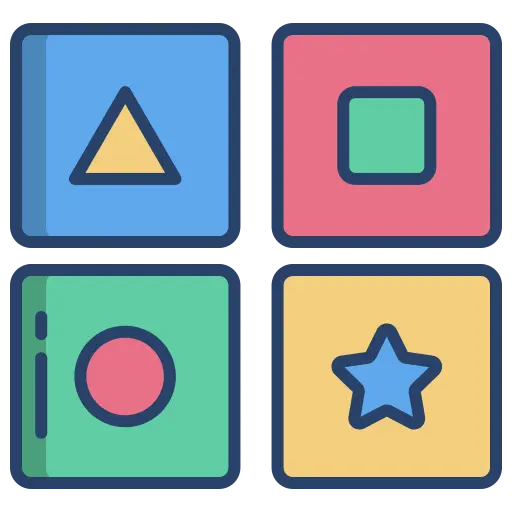
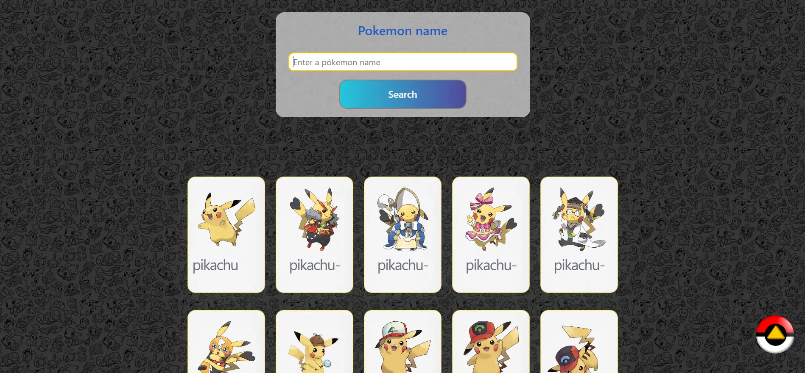
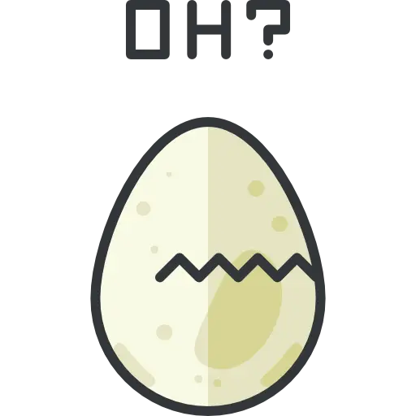
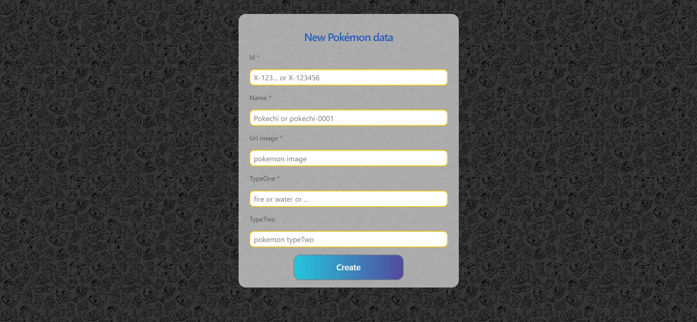
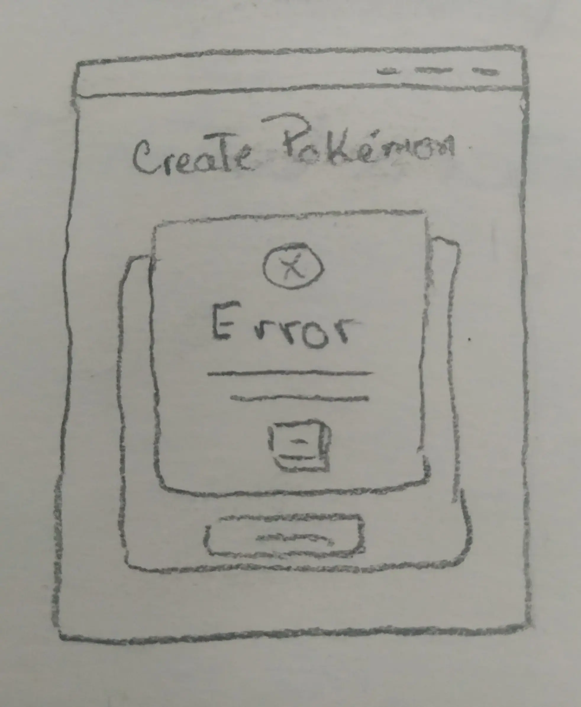
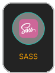
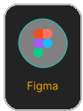
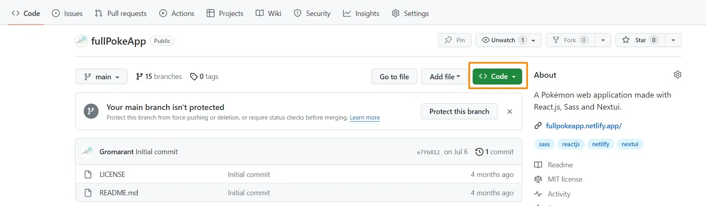

 

 

 

Cambiar a:&nbsp; &nbsp; 

---

# FullPokeApp
Aplicación web de Pokémon desarrollada con React.js, Sass y Nextui. 
 

## Características clave:

 &nbsp; &nbsp;
  Juego de memoria:

 

Desafía tu memoria y tus habilidades cognitivas con un juego de memoria protagonizado por Pokémones.

 

 
 

### Detalles:

El juego comienza con todas las cartas boca abajo y el jugador voltea dos cartas por cada movimiento. Si las dos cartas tienen la misma imagen, se quedan boca arriba; de lo contrario, vuelven a estar boca abajo. 

### Componentes
  - 12 cartas pokémon.
  - Botón de reset, para jugar de nuevo con las mismas cartas en diferente orden.
  - Botón de new Game, para cambiar de cartas.
  - Contador de movimientos.
  - Pop-up con datos de la partida ganada y botones para jugar nueva partida, resetear la partida o cerrar el pop-up.
  
 

 

---

 &nbsp; &nbsp;
Buscador de pokemones:

 

Busca tus Pokémons favoritos y selecciona para ver sus detalles.

 
 

### Detalles:

Busca por coincidencia con el nombre de los pokemons, una vez ingresado el nombre o carácter de búsqueda y presionar search se desplegarán debajo los pokemones que coinciden con la búsqueda.

### Componentes

 - Barra de búsqueda.
 - Lista de pokemones buscados recientemente (vista detalles del pokémon).
 - Lista de pokemones creados.
 - botón para volver al inicio de la página de búsqueda.

 

En esta pantalla podrás ver las listas de los pokemones cuando no haya una búsqueda actual.
  
 

 

---

 &nbsp; &nbsp;
Vista a detalle de Pokémon: 

 

Carta con los detalles del pokémon seleccionado en la lista de búsqueda.

 

### Detalles:

 

  Contiene una carta con los detalles del Pokémon: nombre, imagen, peso, altura, type-One y/o type-Two.

### Componentes

 - Carta de detalles del pokémon.
 - Botón para volver al buscador.
  
 

 

---

 &nbsp; &nbsp;
Creación de Pokémon:

 

Crea tus propios pokemones, personaliza su apariencia, atributos.

 
 

### Detalles:

 

### Componentes

 - Formulario de creación.
 - Pop-up de error, con detalles y ejemplos para el rellenado de los input.
  
 

 

## Objetivos: 

 - Desarrollo de aplicación web con React.js (Vite) y Sass.
 - Trabajar con consumo de Api, react form, hooks e integración de componentes de librerías externas.
  
 

 

 

## Diseño: 

&nbsp; &nbsp;  &nbsp; &nbsp; Wireframes:

 

### Detalles: 

<h2>Juego de memoria | Componentes destacados:</h2>

<strong>Contador de movimientos:</strong> muestra el número de movimientos realizados.

<strong>Botón de reset:</strong> Permite al usuario reiniciar el juego con las mismas cartas.

<strong>Pop-up:</strong> Alerta que muestra datos del juego y botones de opción.

 

 

---

<h2>Página de búsqueda:</h2>

<strong>Buscador:</strong> Permite a los usuarios buscar Pokemones por coincidencias con los nombres.

<strong>Botón para subir:</strong>  para hacer scroll de la página hacia arriba.

<strong>Listas de pokemones buscados y creados.</strong>

 

 

---

<h2>Página de creación:</h2>

<strong>Formulario:</strong> desarrollado con react-hook-form.

<strong>Pop-up de error:</strong> Permite al usuario completar correctamente los campos del formulario.

 

 

---

<h2>Página de detalles de Pokémon:</h2>

<strong>Ficha de detalles de Pokémon:</strong> Con más información sobre los Pokémon seleccionados.

<strong>Botón de búsqueda:</strong> Para volver a la página de búsqueda.

<strong>Lista de Pokemones buscados y creados.</strong>

 

 
 

---

 

## Lenguajes y herramientas:

Usados en el desarrollo del proyecto:

 &nbsp; &nbsp;
 &nbsp; &nbsp;
 &nbsp; &nbsp;

 

Empleados en el diseño del proyecto:

 

## Copia e implementación de este proyecto:

&nbsp; &nbsp;  &nbsp; &nbsp; Instrucciones:

 

<h2>Copiar el repositorio:</h2>

1. Navegar al repositorio ( [Gromarant/fullPokeApp](https://github.com/Gromarant/fullPokeApp)).
2. Haz lick en el botón de Fork, en la parte superior derecha.

 

<h2>Clonar en local:</h2>

3. Sobre las listas de los archivos, haz click en el botón <> code. 
  
 
 

    
 
 
4. Copia la URL del repositorio.
5. Abre la terminal.
6. cambia de directorio a la ubicación dónde quieres que se guarde la copia del proyecto.

> ``cd nueva_ubicación``
  
 
 
7. Escribe `git clone` y pega la URL que copiaste antes.

> ``git clone https://github.com/tu-nombreDeUsuario/fullPokeApp``
  
 
 
8. Presiona **Enter** para crear tu clon en local.&nbsp; &nbsp;
[Visitar guía para hacer fork y clonar un repositorio](https://docs.github.com/es/get-started/quickstart/fork-a-repo)

<h2>Correr tu repositorio en local:</h2>

1. Abre la terminal y navega a la carpeta de tu repositorio en local.
> ``cd local_repo_path``

 

2. Instala las dependencias
> `npm install`

Este comando crea la carpeta "node_modules"  con todas las dependencias que necesita el proyecto.

 

3. Corre la aplicación
> `npm run dev`

---

 

## Next implementations:

 - **Vista a detalle del Pokémon:** Agregar más detalles (ataques, daño, etc.).
 - **Juego de memoria:** con los pokemones creados por el usuario.
 - **Enciclopedia PokéDex:** para descubrir información más detallada sobre las especies de Pokémon, sus habilidades y evoluciones.

 

## Profesionales:

<a href="https://www.linkedin.com/in/mariangelicarodriguezperez/">

</a>

---

  

© Mariangelica Rodriguez

 &nbsp; &nbsp;
 &nbsp; &nbsp;

 

