
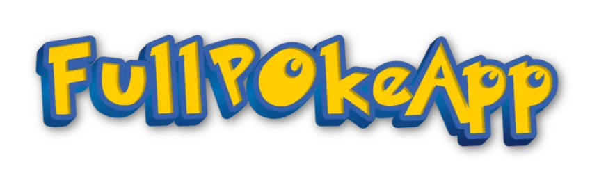

 

 

 

Change to:&nbsp; &nbsp; 

---

# FullPokeApp
A Pokémon web application made with React.js, Sass and Nextui.

 

## Key features:

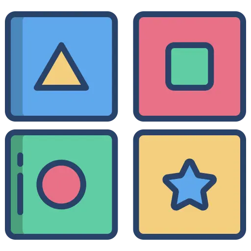 &nbsp; &nbsp;
  Memory game:

 

Challenge your memory and cognitive skills with a memory game featuring Pokémon.

 

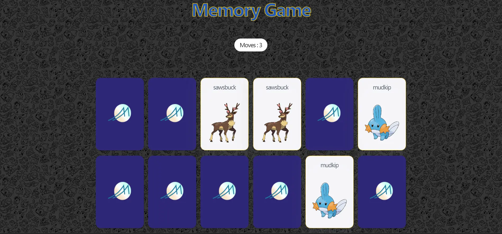

 
 

### Details:

The game begins with all cards face down and the player turns over two cards for each move. If the two cards have the same image, they remain face up; otherwise, they are face down again.

### Components
  - 12 pokémon cards.
  - Reset button, to play again with the same cards in a different order.
  - New game button, to change cards.
  - Movement counter.
  - Pop-up with data about the game won and buttons to play a new game, reset the game or close the pop-up.

 

 

---

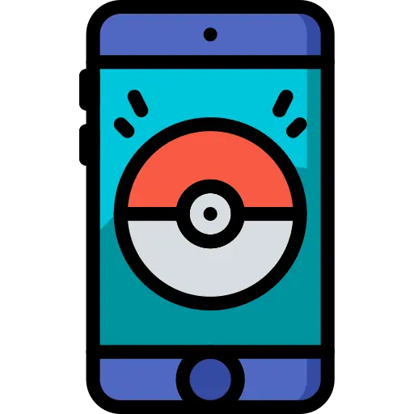 &nbsp; &nbsp;
  pokemon search:

  
 

Search for your favorite Pokemon and select to see their details.

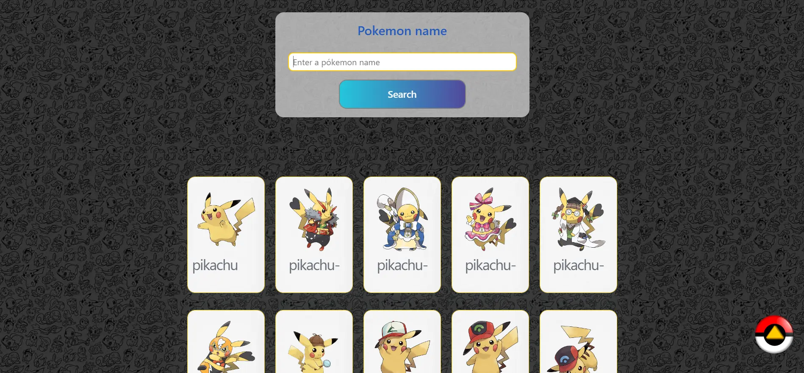

 
 

### Details:

Search by matching the name of the Pokemon. Once you enter the search name or character and press search, the pokemon that matches the search will be displayed below.

### Components

 - Search bar.
 - Recent Pokemon search list (Pokemon details view).
 - List of created pokemons.
 - Button to return to the top of the search page.

 

On this page you can see the pokemon lists when there is not a search in course.

 

 

---

Pokemon details view: 

 

Here you see the card with the details of the Pokemon selected in the search list.

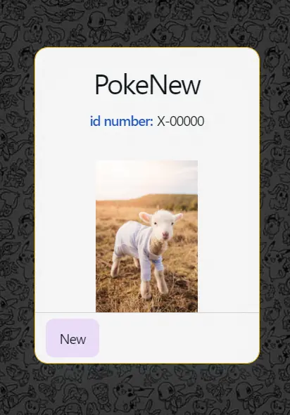

 

### Details:

 

It contains a card with the Pokémon's details: name, image, weight, height, type-One and/or type-Two.

### Components

 - Pokémon Details Card.
 - Button to return to the search engine.

 

 

---

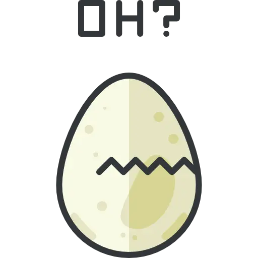
Pokemon creation: 

 

Create your own pokemons, customize their appearance, attributes.

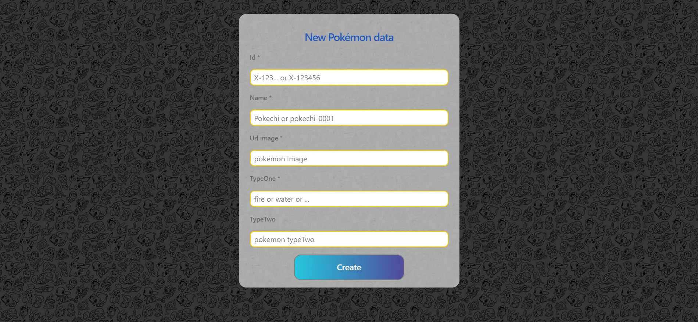

 
 

### Details:

 

### Components

 - Creation form.
 - Error pop-up, with Details and examples for filling out the input.

 

 

---

## Objectives: 

 - Web application development with React.js (Vite) and Sass.
 - Work with Api consumption, react form, hooks and integration of Components from external libraries.

 

 

 

## Design: 

&nbsp; &nbsp;  &nbsp; &nbsp; Wireframes:

 

### Details: 

<h2>Memory game | Featured components:</h2>

<strong>Movements Counter:</strong> To know how many movements have been made.

<strong>Reset button:</strong> Allows the user to restart the game with the current cards.

<strong>Pop-up:</strong> Alert showing game data and option buttons.

 

 

---

<h2>Search Page:</h2>

<strong>Search engine:</strong> Allows users to search for matches on Pokémon names.

<strong>Go up button:</strong>  To scroll up.

<strong>Pokemon searched and created lists.</strong>

 

 
 

---

<h2>Create page:</h2>

<strong>Form:</strong> Made with react-hook-form.

<strong>Error Pop-up:</strong> Allows the user to fill out form fields correctly.

 

 
 

---

<h2>Pokemon details Page:</h2>

<strong>Pokémon details card:</strong> With more information about the selected Pokémon.

<strong>Search button:</strong> To come back to the search page.

<strong>Pokemon searched and created lists.</strong>

 

 
 

---

 

## Languages and tools:

Use for the project development:

<a href="https://react.dev/" target="_blank">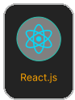</a> &nbsp; &nbsp;
<a href="https://sass-lang.com/" target="_blank">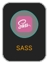</a> &nbsp; &nbsp;
<a href="https://sass-lang.com/" target="_blank">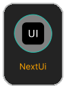</a> &nbsp; &nbsp;
<a href="https://github.com/about" target="_blank">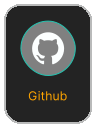</a>

 

Employed in the project design:

<a href="https://www.figma.com/" target="_blank">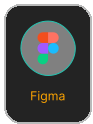</a>

 

## Copy and implementation of this project:

&nbsp; &nbsp;  &nbsp; &nbsp; Instructions:

 

<h2>Copy the repo:</h2>

1. Navigate to the repository ( [Gromarant/fullPokeApp](https://github.com/Gromarant/fullPokeApp)).
2. Click the Fork button in the top-right corner.

 

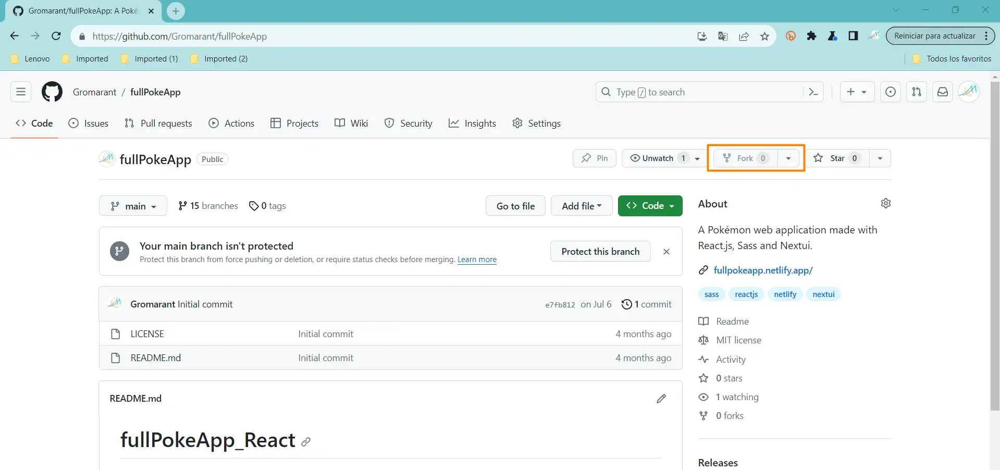

<h2>Clone locally:</h2>

3. Above the list of files, click <> code.
  
 
 
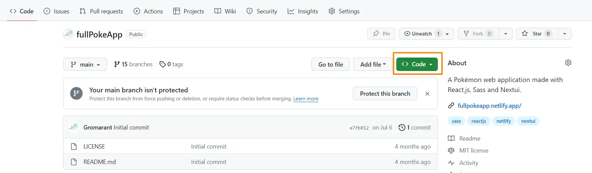
    
 
 
4. Copy the URL for the repo.
5. Open terminal.
6. Change to the location where you want the clone.

> ``cd new_directory_path``
  
 
 
7. Type `git clone`, and then paste the URL you copied earlier.

> ``git clone https://github.com/YOUR-Username/fullPokeApp``
  
 
 
8. Press **Enter** to create your local clone.&nbsp; &nbsp;
[Visit github forking and cloning guide](https://docs.github.com/en/get-started/quickstart/fork-a-repo)

<h2>Run your local repository:</h2>

1. Open terminal and navigate to your local repository.
> ``cd local_repo_path``

 

2. Install dependencies 
> `npm install`

This command creates a "node_modules" folder with all the dependencies that the project needs.

 

3. Run the app
> `npm run dev`

---

 

## Next implementations:

 - **Pokémon detail view:** Add more details (attacks, damage, etc.).
 - **Memory game:** with created Pokémons.
 - **PokéDex Encyclopedia:** Discover detailed information about each species of Pokémon, their abilities and evolutions.

 

## Professionals:

<a href="https://www.linkedin.com/in/mariangelicarodriguezperez/">

</a>

---

  

© Mariangelica Rodriguez

 &nbsp; &nbsp;
 &nbsp; &nbsp;

 

