<!-- PokeApp banner -->

  

  
  

 

Change to:&nbsp; &nbsp; 

---
<!-- title and description -->
# FullPokeApp
A Pokémon web application made with React.js, Sass and Nextui.
 

## Key features:

  

   &nbsp; &nbsp;
    Memory game:
  

 

Challenge your memory and cognitive skills with a memory game featuring Pokémon.

 

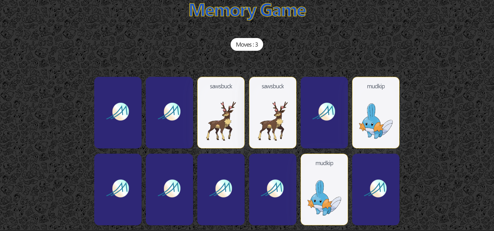

 
 

### Details:

  

  The game begins with all cards face down and the player turns over two cards for each move. If the two cards have the same image, they remain face up; otherwise, they are face down again.

### Components
  - 12 pokémon cards.
  - Reset button, to play again with the same cards in a different order.
  - New game button, to change cards.
  - Movement counter.
  - Pop-up with data about the game won and buttons to play a new game, reset the game or close the pop-up.

  

---

  

   &nbsp; &nbsp;
    pokemon search:
  

  
 

Search for your favorite Pokemon and select to see their details.

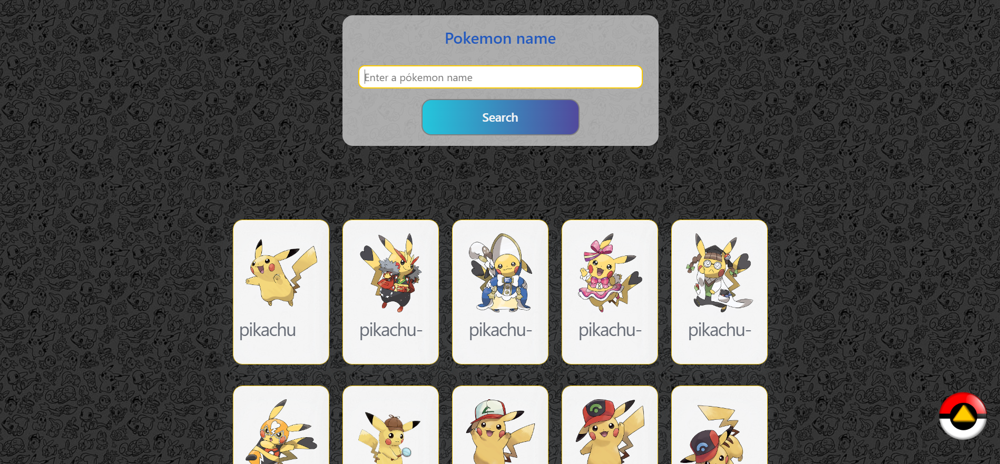

 
 

### Details:

  

  Search by matching the name of the Pokemon. Once you enter the search name or character and press search, the pokemon that matches the search will be displayed below.

### Components

 - Search bar.
 - Recent Pokemon search list (Pokemon details view).
 - List of created pokemons.
 - Button to return to the top of the search page.

 

  On this page you can see the pokemon lists when there is not a search in course.
  

---

  

  
  Pokemon creation: 
  

 

Create your own pokemons, customize their appearance, attributes.

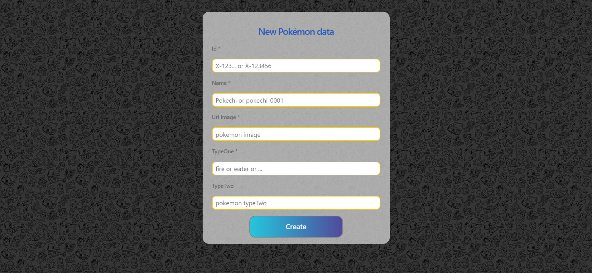

 
 

### Details:

 

  

### Components

 - Creation form.
 - Error pop-up, with Details and examples for filling out the input.

  

---

  

  
  Pokemon details view: 
  

 

 

Here you see the card with the details of the Pokemon selected in the search list.

  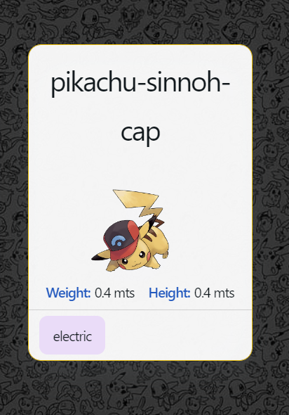
  

 

### Details:

 

  

  It contains a card with the Pokémon's details: name, image, weight, height, type-One and/or type-Two.

### Components

 - Pokémon Details Card.
 - Button to return to the search engine.

  

---

<a href="https://fullpokeapp.netlify.app/">
  

    
  

</a> 

## Objectives: 

 - Web application development with React.js (Vite) and Sass.
 - Work with Api consumption, react form, hooks and integration of Components from external libraries.

 

## Design: 

  
&nbsp; &nbsp;  &nbsp; &nbsp; Wireframes:

 

### Details: 

  

  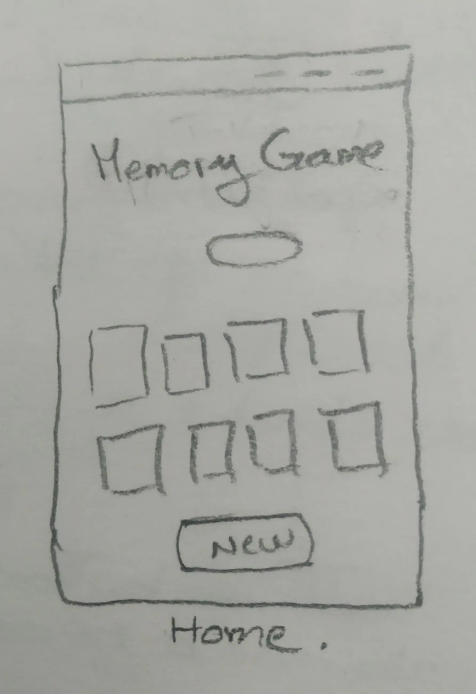
  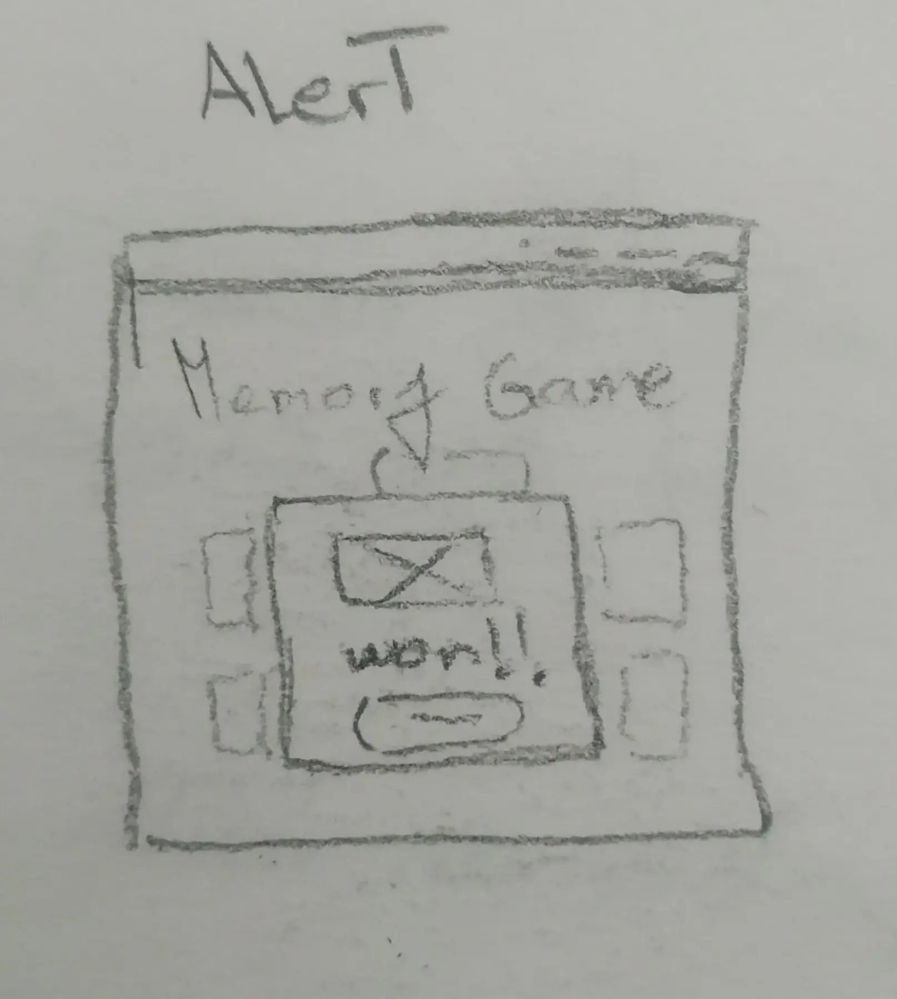
  

    <h2>Memory game | Featured components:</h2>
    
<strong>Movements Counter:</strong> To know how many movements have been made.

    
<strong>Reset button:</strong> Allows the user to restart the game with the current cards.

    
<strong>Pop-up:</strong> Alert showing game data and option buttons.

    <a href="https://www.gromarant.com/">See more details</a>
  

  

  

  

    <h2>Search Page:</h2>
    
<strong>Search engine:</strong> Allows users to search for matches on Pokémon names.

    
<strong>Go up button:</strong>  To scroll up.

    
<strong>Pokemon searched and created lists.</strong>

    <a href="https://www.gromarant.com/">See more details</a>
  

  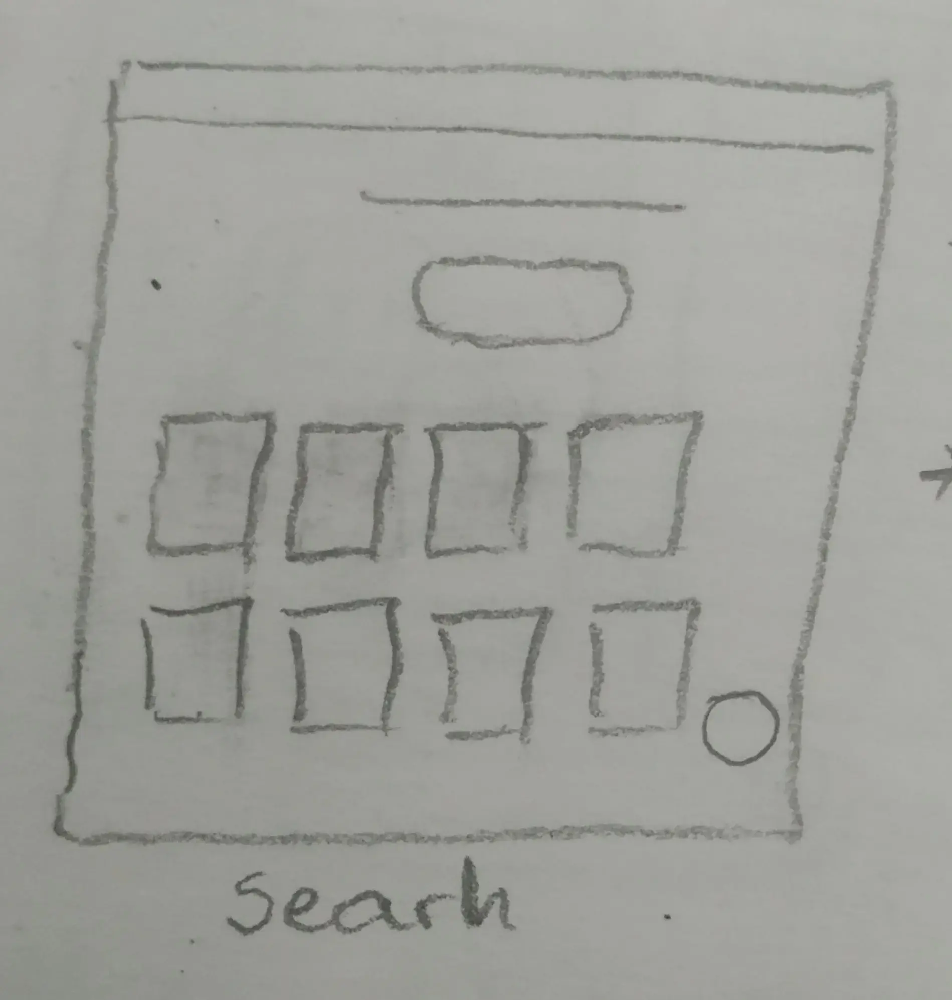
  
  

  

  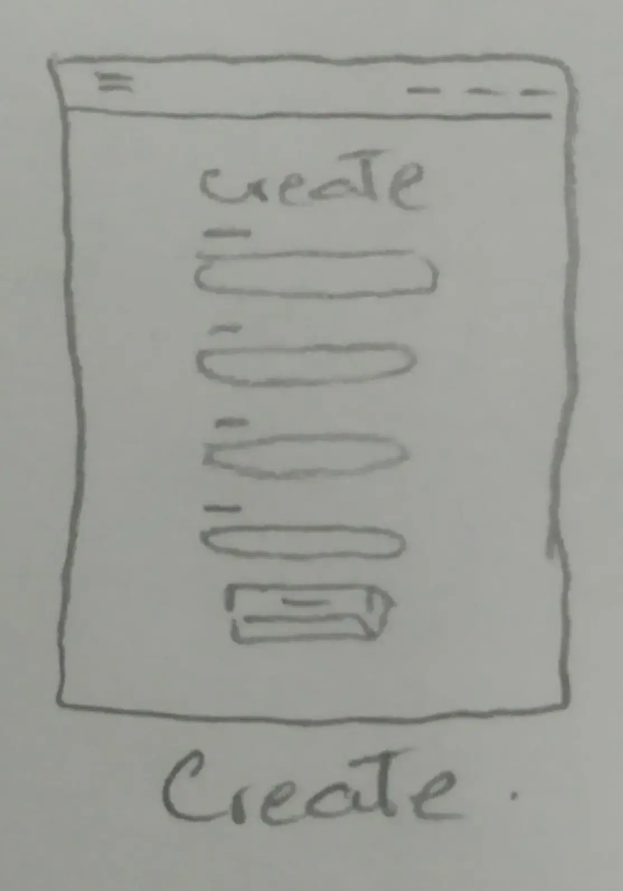
  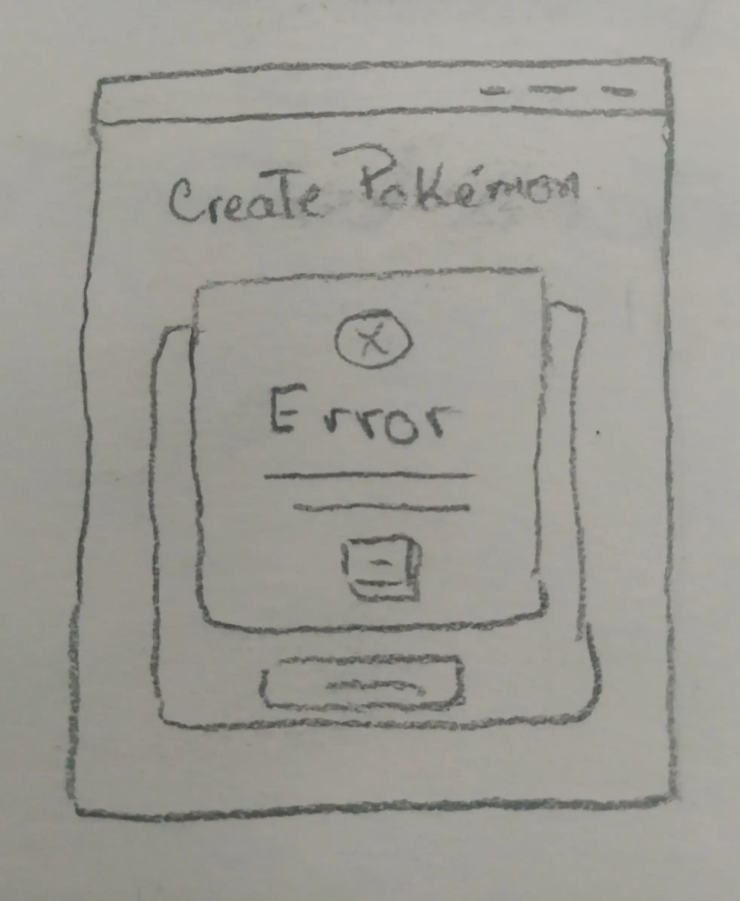
  

    <h2>Create page:</h2>
    
<strong>Form:</strong> Made with react-hook-form.

    
<strong>Error Pop-up:</strong> Allows the user to fill out form fields correctly.

    <a href="https://www.gromarant.com/">See more details</a>
  

  

  

  

    <h2>Pokemon details Page:</h2>
    
<strong>Pokémon details card:</strong> With more information about the selected Pokémon.

    
<strong>Search button:</strong> To come back to the search page.

    
<strong>Pokemon searched and created lists.</strong>

    <a href="https://www.gromarant.com/">See more details</a>
  

  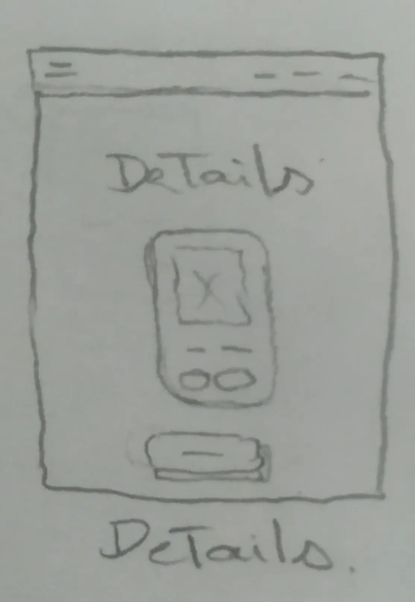
  

---

 

## Tools:

 

  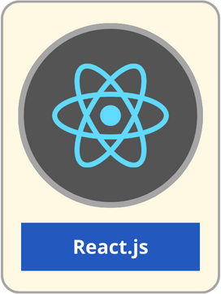&nbsp; &nbsp;
  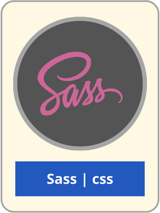&nbsp; &nbsp;
  

 

## Copy and implementation of this project:

  
&nbsp; &nbsp;  &nbsp; &nbsp; Instructions:

 

xxxxxxxxxx

 
 

### Details:

 

  

### Components

 - xxxxxxxxxxxx
  

---

 

## Next implementations:

 - **Pokémon detail view:** Add more details (attacks, damage, etc.).
 - **Memory game:** with created Pokémons.
 - **PokéDex Encyclopedia:** Discover detailed information about each species of Pokémon, their abilities and evolutions.

 

## Professionals:

  

---

 

<footer__wrapper>
  
<footer__background>

  
<footer__brand>
  <a href="https://www.gromarant.com/" style="text-align:center;">
  
  
© Mariangelica Rodriguez

  </a>
  </footer__brand>

  
<footer__rrss>
  
  
  </footer__rrss>

  </footer__background>

</footer__wrapper>

